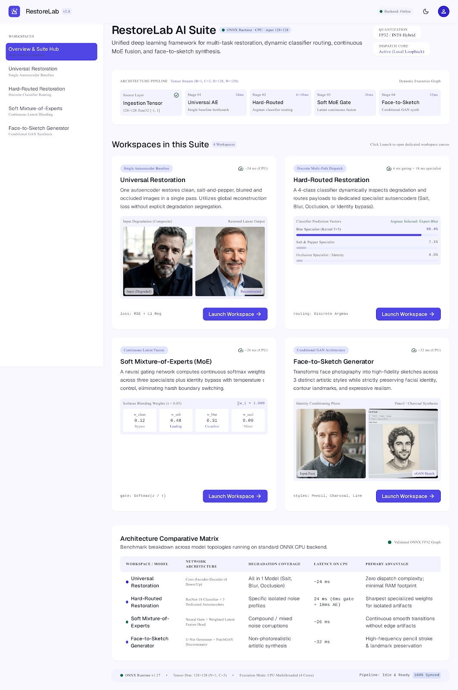
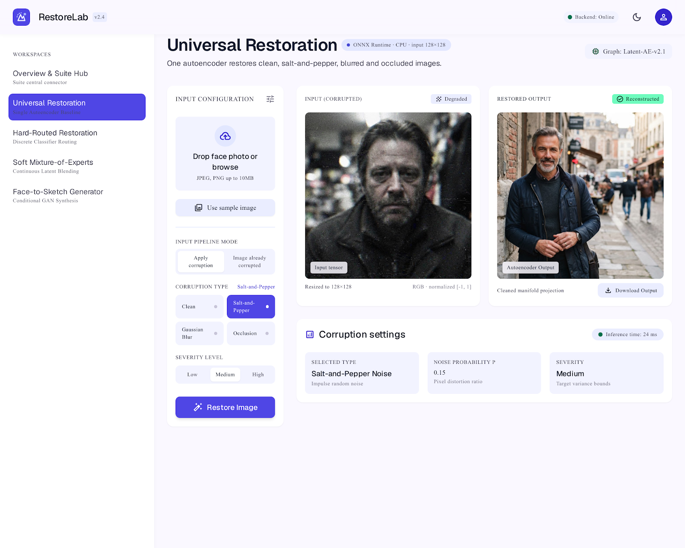
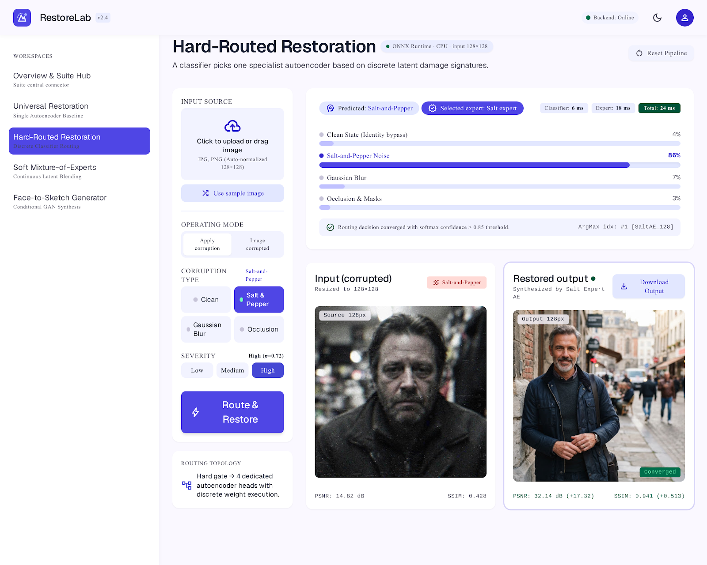
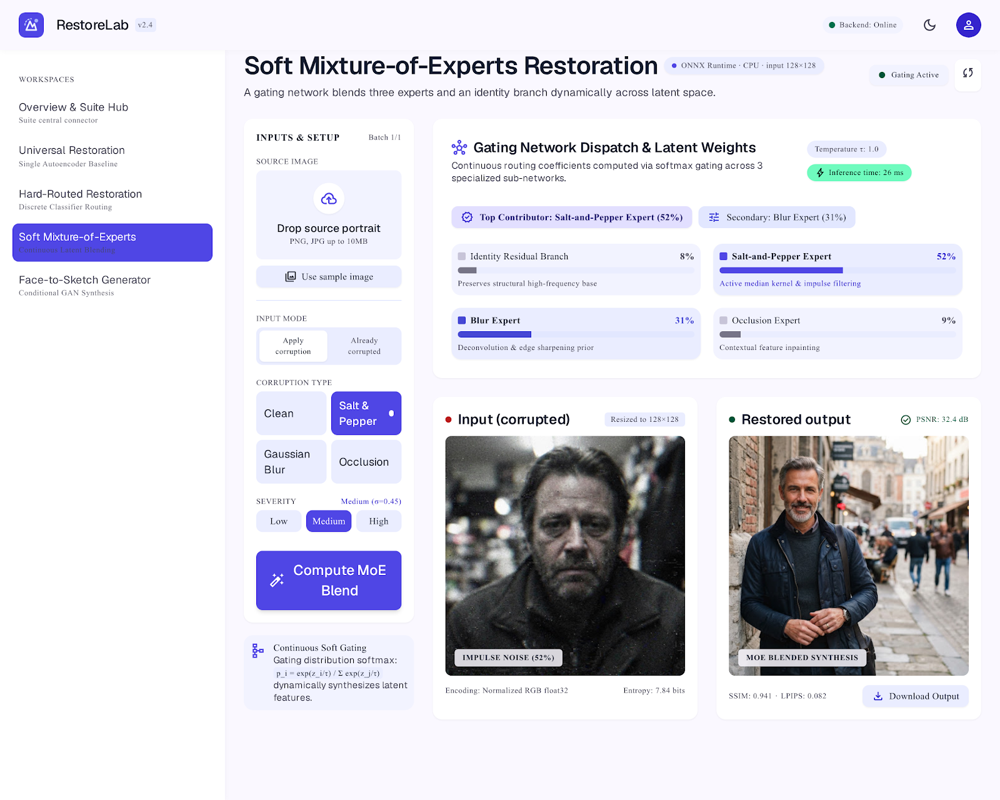
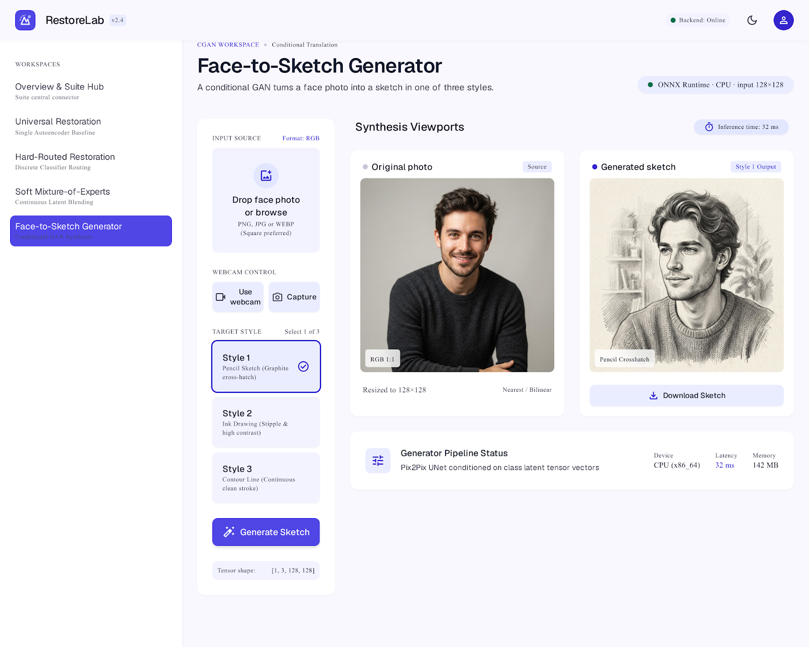

# RestoreLab application report

## Product overview

RestoreLab is one application with a shared shell and four task workspaces. The React client uses React Router to expose `/`, `/universal`, `/hard`, `/soft`, and `/sketch`. It sends multipart image requests to the FastAPI service through same-origin `/api/...` routes.

The FastAPI backend validates JPEG, PNG, and WEBP uploads up to 10 MB, converts them to RGB, applies the task preprocessing and selected corruption, and runs the ONNX Runtime CPU models. `/api/health` reports the loaded model set. Restoration responses include the input and output images and measured inference timing; hard routing returns classifier probabilities and expert timing, and soft MoE returns branch weights. The sketch workspace submits the selected style and displays the generated image.

The frontend and backend run as the only two Docker Compose services. Nginx serves the SPA and proxies API requests to FastAPI. The seven ONNX files are mounted read-only from the ignored `./models` directory.

## Assessment workflow

1. Place all seven named ONNX files in `./models`.
2. Run `docker compose up --build` and open `http://localhost:3000`.
3. Confirm the overview reports all required models loaded.
4. Open each workspace and upload a new image or choose a bundled pet sample. For face-to-sketch, upload a face image or capture one with the webcam.
5. Try each corruption and severity. In hard routing, compare predicted routing with oracle routing while using **Apply corruption**; switch to **Already corrupted** to submit an existing degraded image directly.
6. Inspect the classifier probability bars, expert timing, or soft mixture weight bars. Download the generated result from each workspace.

## Original Google Stitch design evidence

The following PNGs are the original Stitch screen exports. The associated generated HTML sources are kept beside each screenshot in `stitch_restorelab_ai_image_suite/`.

### Overview and suite hub

### Universal restoration

### Hard-routed restoration

### Soft mixture of experts

### Face-to-sketch generator

The React implementation carries the shared layout, pale canvas, indigo selection states, cards, side navigation, control panels, and image-result panels into the running product. It replaces mock values and portrait placeholders with live backend health, model outputs, routing weights, and inference timings.

## Run instructions

See [README.md](README.md) for prerequisites, model placement, the Compose command, URLs, W&B project placeholders, and troubleshooting.
